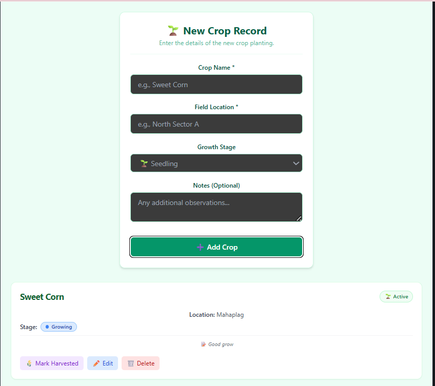
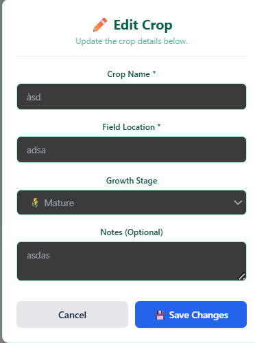
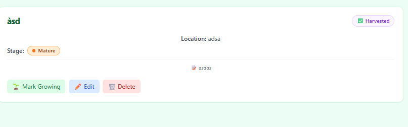

# AgriTrack Hub

A farm crop management application that helps farmers track and manage their crops, field locations, and harvest schedules with an intuitive interface.

---

## Team Members

| Full Name             | Role      | GitHub Username   | Assigned Atomic Task                                        |
| --------------------- | --------- | ----------------- | ----------------------------------------------------------- |
| Abenoja, Jaaseia Gian | Developer | @jaaseiadev       | [feature/add-crop, initialized Tailwind CSS, documentation] |
| Balajadia, Ericson    | Developer | @ericsonbalajadia | [feature/crop-edit]                                         |
| Montera, Mhac Alester | Developer | @mteraaa          | [feature/delete-crop, bugfixes, documentation]              |
| Nocerale, Angel       | Developer | @NoSeeReally      | [feature/crop-list-display]                                 |
| Paloma, Nexus         | Developer | @NexusfPaloma     | [feature/growth-stage-ui]                                   |
| Sinday, Ruel Angelo   | Developer | @RASinday         | [feature/crop-filter]                                       |

---

## Features Implemented

- [x] Add Crop - Create new crop records with name, field location, and growth stage
- [x] Crop List Display - Show all crops in organized format
- [x] Filter by Status - Toggle between active/harvested/all crops
- [x] Mark Harvested/Active - Toggle crop harvest status
- [x] Edit Crop - Modify existing crop details
- [x] Delete Crop - Remove crop records with confirmation
- [x] Growth Stage Indicators - Visual growth stages (Seedling/Growing/Mature)
- [ ] [Add any additional features implemented]

---

## Technology Stack

- **Frontend Framework:** React
- **Language:** TypeScript / JavaScript
- **Build Tool:** Vite / Create React App
- **Styling:** [Your choice - CSS/Tailwind/etc.]
- **State Management:** React Hooks (useState, useEffect)
- **Version Control:** Git & GitHub

---

## Setup & Installation

### Prerequisites

- Node.js (v18 or higher)
- npm or yarn
- Git

### Installation Steps

1. **Clone the repository**

   ```bash
   git clone https://github.com/csci151-agriflow-org/agritrack-hub.git
   cd agritrack-hub
   ```

2. **Install dependencies**

   ```bash
   npm install
   ```

3. **Run the development server**

   ```bash
   npm run dev
   ```

4. **Open your browser**

   Open [http://localhost:5173](http://localhost:5173) (or the port specified in your terminal) to view the application.

---

## Git Workflow & Branching Strategy

### Branches Used

- **`main`** - Production-ready code
- **`develop`** - Integration branch for features
- **`feature/add-crop`** - Implements the functionality to add new crop records with their details
- **`feature/crop-filter`** - Adds the ability to filter crops based on their current status (All, Active, Harvested)
- **`feature/crop-edit`** - Enables updating and modifying details of existing crop records
- **`feature/growth-stage-ui`** - Adds UI indicators for the crop's growth stage (Seedling, Growing, Mature)
- **`feature/delete-crop`** - Features a way to safely remove a crop record from the application

### Commit Convention

We followed the **Conventional Commits** specification:

- `feat:` - New features
- `fix:` - Bug fixes
- `docs:` - Documentation updates
- `style:` - Code formatting, UI styling
- `refactor:` - Code refactoring

### Pull Request Workflow

1. Create feature branch from `develop`
2. Implement feature with atomic commits
3. Push branch to GitHub
4. Create Pull Request to `develop`
5. Team reviews and provides feedback
6. Merge after approval
7. Delete feature branch

### Merge Conflicts Resolved

[Document conflicts here]

**Example:**

- **Conflict:** Merge conflict in `App.tsx` when merging `feature/crop-list` into `develop`
- **Files Affected:** `src/App.tsx`
- **Cause:** Multiple members edited crop state management
- **Resolution:** [Describe how resolved]
- **Resolved By:** [Team Member Name]

---

## Project Structure

```
agritrack-hub/
├── instructions/
│   └── Group_1_README.md
├── public/
├── src/
│   ├── assets/
│   ├── components/
│   │   ├── CropForm.tsx
│   │   ├── CropItem.tsx
│   │   ├── CropList.tsx
│   │   └── FilterButtons.tsx
│   ├── App.css
│   ├── App.tsx
│   ├── index.css
│   ├── main.tsx
│   ├── tailwind.css
│   └── types.ts
├── eslint.config.js
├── index.html
├── package.json
├── postcss.config.js
├── README.md
├── tailwind.config.js
├── tsconfig.json
└── vite.config.ts
```

---

## Screenshots

### Home Page


_The main dashboard of AgriTrack Hub displaying the form to add a new crop and the list of your active crops._

### Edit Crop


_The form to safely update existing crop details such as the crop name, field location, and growth stage._

### Crop Item Details


_A detailed view of a single crop card showing its status, location, stage, notes, and the action buttons for managing it._

---

## Challenges & Learnings

**Challenges:**

- During the development of AgriTrack Hub, our team navigated several significant hurdles. We experienced a short electricity blackout that temporarily cut off our internet access and AI assistance, forcing us to rely entirely on our offline knowledge and local environments. Additionally, since some members were new to the strict GitFlow process, the team had a steep learning curve adapting to the collaborative branching strategy. This adjustment period inevitably led to several complex merge conflicts and required dedicated time for bug fixes when integrating our feature branches. To overcome these workflow hurdles and maximize our efficiency, we also had to execute a major reassignment of atomic tasks mid-development to better align with the team's capacity and ensure a successful project delivery.

**Key Learnings:**

- The team learned that using feature branches for each major feature, combined with Conventional Commits (feat:, fix:, refactor:), kept the Git history clean and prevented integration conflicts. Making atomic commits (at least 3 per feature) allowed us to isolate changes and simplify debugging. Resolving a merge conflict in App.tsx (caused by two branches modifying state handlers) taught us to communicate before merging and use Git's conflict resolution tools effectively. Pull requests with review comments caught issues early, such as missing props in CropList.

- The collaboration part is we think the most hard part in this group since we barely know eachother but we still prevailed, breaking features into small, assignable tasks (edit form, delete button, status toggle) enabled parallel work without stepping on each other's code. Daily sync meetings helped align on component props and state management patterns. Using a shared TypeScript interface (Crop) ensured consistency across components built by different developers. Peer reviews caught bugs like the missing notes field and incorrect FilterButtons usage, reinforcing the value of a second pair of eyes. Finally, documenting the merge conflict resolution in the README served as a reference for future conflicts and improved team knowledge sharing.

---

## Repository Links

- **Organization:** https://github.com/csci151-agriflow-org
- **Repository:** https://github.com/csci151-agriflow-org/agritrack-hub

---

## Contributors

**Group 1 - CSci 151 Event Driven Programming**

- Abenoja, Jaaseia Gian - @jaaseiadev
- Balajadia, Ericson - @ericsonbalajadia
- Montera, Mhac Alester - @mteraaa
- Nocerale, Angel - @NoSeeReally
- Paloma, Nexus - @NexusfPaloma
- Sinday, Ruel Angelo - @RASinday

**Course Professors:**

- Mr. Jomari Joseph A. Barrera
- Mr. Kyle Anthony F. Nierras

**Institution:** Visayas State University - Department of Computer Science and Technology

---

**Last Updated:** [April 7, 2026]
